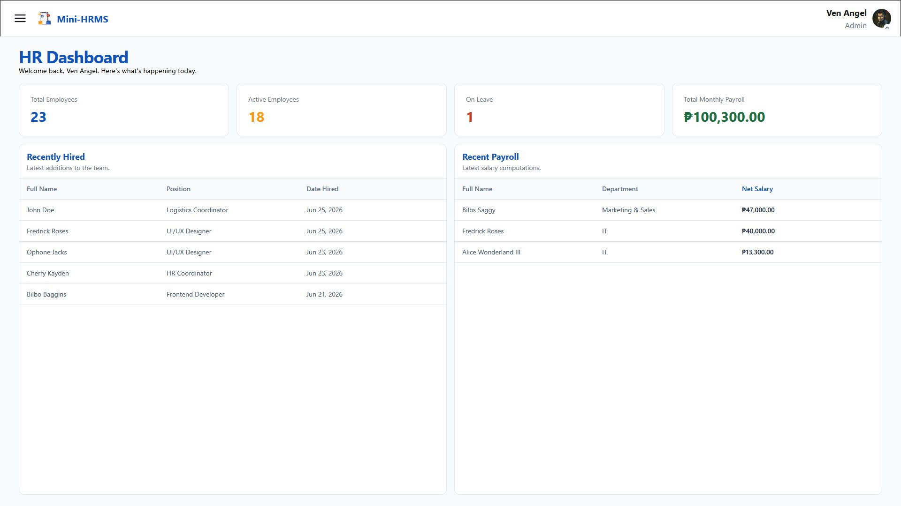
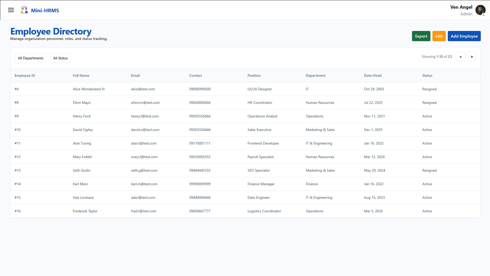
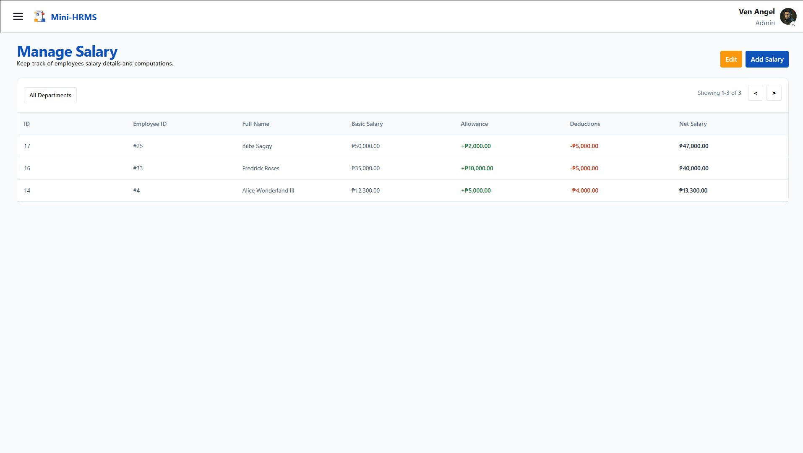
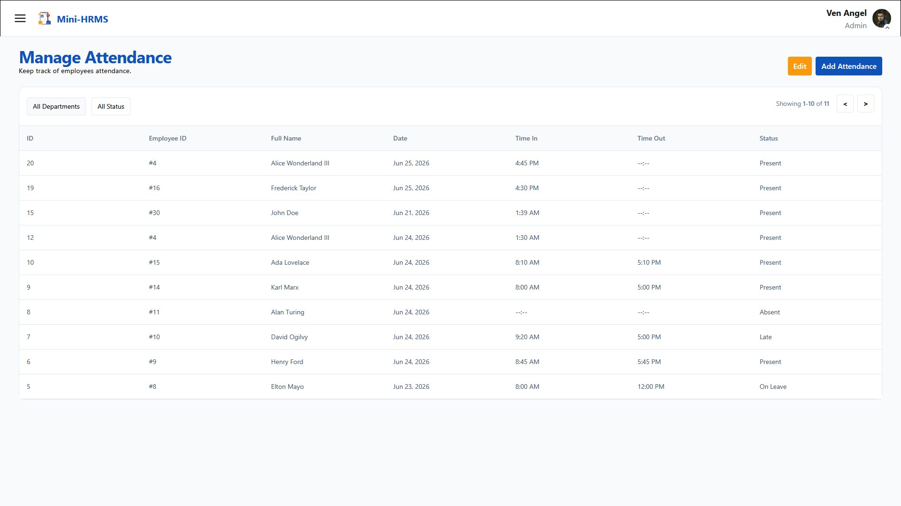
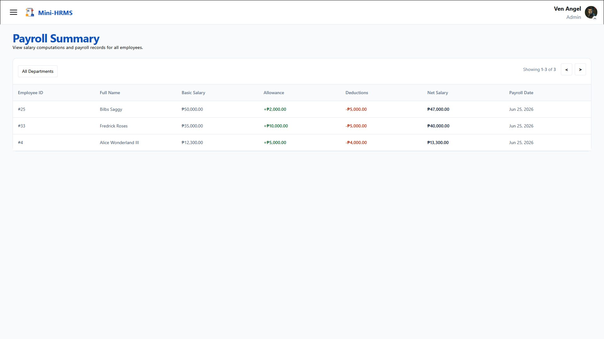

# Mini HRMS System

A professional Human Resource Management System designed to streamline employee data, attendance tracking, and payroll computation.

---

## Project Overview

The **Mini HRMS System** is a full-stack application developed for the Cube Tech Innovations internship assessment. It provides administrators with a centralized platform to manage human resources efficiently.

## Tech Stack

- **Frontend:** React.js, Tailwind CSS
- **Backend:** Express.js
- **Database:** PostgreSQL

---

## System Interface

|              Login Page              |                   Dashboard                   |             Employee Management              |
| :----------------------------------: | :-------------------------------------------: | :------------------------------------------: |
|  |  |  |

|            Salary Management            |                   Attendance                    |              Payroll Summary              |
| :-------------------------------------: | :---------------------------------------------: | :---------------------------------------: |
|  |  |  |

---

## Installation Guide

### 1. Prerequisites

Ensure you have the following installed on your machine:

- [Node.js](https://nodejs.org/) (v18+)
- [PostgreSQL](https://www.postgresql.org/)

### 2. Database Setup

1. Create a PostgreSQL database
2. Run the migrations in order to create the tables
3. (Optional) Run the seeds to populate sample data

### 3. Environment Setup

In the backend folder, copy the example env file and fill in your database credentials:

```bash
cp .env.example .env
```

Your `.env` should look like this:

### 4. Getting Started

Clone the repository:

```bash
git clone https://github.com/Benenendyel/mini-hrms.git
cd mini-hrms
```

Open two terminals and run both servers:

**Terminal 1 — Backend:**

```bash
cd backend
npm install
npm run dev
```

**Terminal 2 — Frontend:**

```bash
cd frontend
npm install
npm run dev
```

Open your browser and go to `http://localhost:5173`

### 5. Login Credentials

**Account 1:**

- **Email:** admin@test.com
- **Password:** admin123

**Account 2:**

- **Email:** jormugandr@gmail.com
- **Password:** 12345678

---

## Note(s)

- **Why not users table:** Because I chose static for the admin table
- **Layouts:** Had help using Google Stitch for immediate templating and visualization.
- **Colors:** I just took the colors from the icon I found from flatIcon website.
